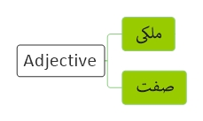

<!----------------------------------------------------------------------------------[CSS]-->

<!----------------------------------------------------------------------------------[Index]-->
# [Adjective](../index.md) 

<!----------------------------------------------------------------------------------[Pages]-->
[English](index.md) |
[Verb](verb.md) |
[Name](name.md) | 
[Adjective](adjective.md) | 
[Pronouns](pronouns.md) | 
[Adverb](adverb.md) | 
[Preposition](preposition.md) | 
[Prefix](prefix.md) | 
[Postfix](postfix.md) | 
[Interjection](interjection.md) |
[Conjunction](conjunction.md) |
[Subject](subject.md)

<!----------------------------------------------------------------------------------[Diagram]-->

<!----------------------------------------------------------------------------------[subject]-->
<a href="#be">Be</a> - 

<!------------------------------------------------------------------- [ AAA ] --->

## AAA

Adjectives often followa form of be 

<table><tbody>
<tr>
<td align="center" bgcolor="D1ECCF"></td>
<td align="center" bgcolor="D1ECCF">Subject</td>
<td align="center" bgcolor="D1ECCF">Verb</td>
<td align="center" bgcolor="D1ECCF">Adjective</td>
</tr>
<tr>
<td rowspan="4" align="center">Noun</td>
<td align="center">A ball</td>
<td align="center">Is</td>
<td align="center">Round</td>
</tr>
<tr>
<td align="center">Balls</td>
<td align="center">Are</td>
<td align="center">Round</td>
</tr>
<tr>
<td align="center">Ali</td>
<td align="center">Is</td>
<td align="center">Intelligent</td>
</tr>
<tr>
<td align="center">Ali and zahra</td>
<td align="center">Are</td>
<td align="center">Intelligent</td>
</tr>
<tr>
<td rowspan="4" align="center">Pronoun</td>
<td align="center">I</td>
<td align="center">Am</td>
<td align="center">Hungry</td>
</tr>
<tr>
<td align="center">She</td>
<td align="center">Is</td>
<td align="center">Hungry</td>
</tr>
<tr>
<td align="center">They</td>
<td align="center">Are</td>
<td align="center">Hungry</td>
</tr>
</tbody></table>

<!------------------------------------------------------------------- [ BBB ] --->

## BBB

<!------------------------------------------------------------------- [ Note ] --->

## Note

