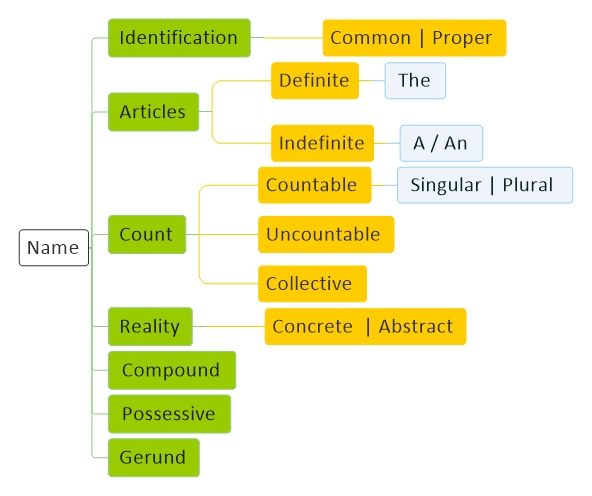

<!----------------------------------------------------------------------------------[CSS]-->

<!----------------------------------------------------------------------------------[Index]-->
# [Name](../index.md) 

<!----------------------------------------------------------------------------------[Pages]-->
[English](index.md) |
[Verb](verb.md) |
[Name](name.md) | 
[Adjective](adjective.md) | 
[Pronouns](pronouns.md) | 
[Adverb](adverb.md) | 
[Preposition](preposition.md) | 
[Prefix](prefix.md) | 
[Postfix](postfix.md) | 
[Interjection](interjection.md) |
[Conjunction](conjunction.md) |
[Subject](subject.md)

<!----------------------------------------------------------------------------------[Diagram]-->

<!----------------------------------------------------------------------------------[subject]-->
<a href="#articles">Articles</a> - 
<a href="#count">Count</a> - 

<!---------------------------------------------------------------------------------- [Articles] --->

## Articles

<!---------------------------------------Definite--> 
#### Definite 
<table><tbody>
<tr>
<td align="center">The</td>
<td></td>
</tr>
</tbody></table>

<!---------------------------------------Indefinite--> 
#### Indefinite 
<table><tbody>
<tr>
<td align="center">A</td>
<td align="center">b | c | d f | g | ...</td>
<td align="center">a bed | a cat | a dog | a friend | a girl</td>
</tr>
<tr>
<td align="center">An</td>
<td align="center">a | e | i | o | u</td>
<td align="center">an animal | an ear | an island | an office</td>
</tr>
</tbody></table>

<!---------------------------------------------------------------------------------- [Count ] --->

## Count

#### Countable 

<!---------------------------------------Singular--> 
Singular 
<table><tbody>
<tr>
<td align="center">cat is a animal</td>
<td>cat=singlur noun | is=singlur verb | a=article | animal=singlur noun</td>
</tr>
<tr>
<td align="center">Bali is an island</td>
<td>bali=singlur noun | is=singlur verb | an=article | island=singlur noun</td>
</tr>
</tbody></table>

<!---------------------------------------Plural--> 
Plural    
<table><tbody>
<tr>
<td align="center">cats are animals</td>
<td>cats=plural noun | are=plural verb | animals=plural noun</td>
</tr>
<tr>
<td align="center">canada and china are countries</td>
<td>canada=plural noun | china=plural noun | are=plural verb | countries=plural noun</td>
</tr>
<tr>
<td align="center">plural nouns end in -s</td>
<td>cat>cats | animal=animls | city>cities | country>countries</td>
</tr>
</tbody></table>