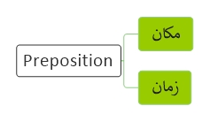

<!----------------------------------------------------------------------------------[CSS]-->

<!----------------------------------------------------------------------------------[Index]-->
# [Preposition](../index.md) 

<!----------------------------------------------------------------------------------[Pages]-->
[English](index.md) |
[Verb](verb.md) |
[Name](name.md) | 
[Adjective](adjective.md) | 
[Pronouns](pronouns.md) | 
[Adverb](adverb.md) | 
[Preposition](preposition.md) | 
[Prefix](prefix.md) | 
[Postfix](postfix.md) | 
[Interjection](interjection.md) |
[Conjunction](conjunction.md) |
[Subject](subject.md)

<!----------------------------------------------------------------------------------[Diagram]-->

<!----------------------------------------------------------------------------------[subject]-->
<a href="#a">a</a> - 
<a href="#b">b</a> - 

<!----------------------------------------------------------------------------------[a]-->

## a

<table><tbody>
<tr>
<td align="center">aa</td>
<td>above | behind | from | next to | under | at | between | in | on</td>
</tr>
</tbody></table>

<!----------------------------------------------------------------------------------[b]-->

## b

<!------------------------------------------------------------------- [ Note ] --->

## Note

