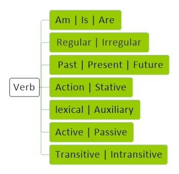

<!----------------------------------------------------------------------------------[CSS]-->

<!----------------------------------------------------------------------------------[Index]-->
# [Verb](../index.md) 

<!----------------------------------------------------------------------------------[Pages]-->
[English](index.md) |
[Verb](verb.md) |
[Name](name.md) | 
[Adjective](adjective.md) | 
[Pronouns](pronouns.md) | 
[Adverb](adverb.md) | 
[Preposition](preposition.md) | 
[Prefix](prefix.md) | 
[Postfix](postfix.md) | 
[Interjection](interjection.md) |
[Conjunction](conjunction.md) |
[Subject](subject.md)

<!----------------------------------------------------------------------------------[Diagram]-->

<!----------------------------------------------------------------------------------[subject]-->
<a href="#be">Be</a> - 

<!----------------------------------------------------------------------------------[What is Data]-->

## Be 

<table><tbody>
<tr>
<td align="center" bgcolor="D1ECCF"></td>
<td align="center" bgcolor="D1ECCF">Simple</td>
<td align="center" bgcolor="D1ECCF">Contraction</td>
<td align="center" bgcolor="D1ECCF">Negative</td>
<td align="center" bgcolor="D1ECCF">Contraction</td>
</tr>
<tr>
<td align="center">Am</td>
<td align="center">I am a student</td>
<td align="center">I'm</td>
<td align="center">I am not a student</td>
<td align="center">I'm not</td>
</tr>
<tr>
<td rowspan="3">Is</td>
<td align="center">She is a student</td>
<td align="center">She's</td>
<td align="center">She is not a student</td>
<td align="center">She's not | She isn't</td>
</tr>
<tr>
<td align="center">He is a student</td>
<td align="center">He's</td>
<td align="center">He is not a student</td>
<td align="center">He's not | He isn't</td>
</tr>
<tr>
<td align="center">It is a cat</td>
<td align="center">It's</td>
<td align="center">It is not a cat</td>
<td align="center">It's not | It isn't</td>
</tr>
<tr>
<td rowspan="3">Are</td>
<td align="center">You are a student</td>
<td align="center">You're</td>
<td align="center">You are not a student</td>
<td align="center">You're not | You aren't</td>
</tr>
<tr>
<td align="center">We are students</td>
<td align="center">We're</td>
<td align="center">We are not students</td>
<td align="center">We're not | We aren't</td>
</tr>
<tr>
<td align="center">They are students</td>
<td align="center">They're</td>
<td align="center">They are not students</td>
<td align="center">They're not | They aren't</td>
</tr>
</tbody></table>

<!------------------------------------------------------------------- [ Note ] --->

## Note

